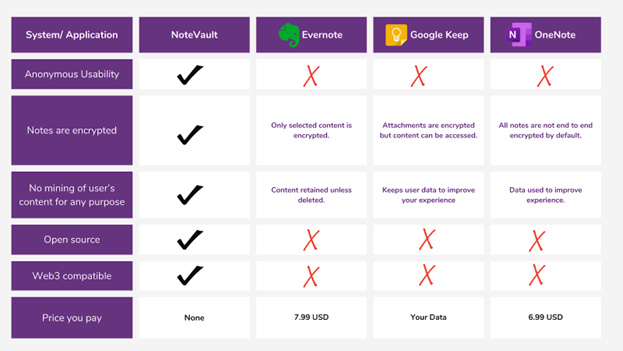

# Report: Team 2

## **Overview of the System:** 

### Why was it developed? 

Recording information in the form of notes is such a ubiquitous activity that it has been largely trivialized. However, notes are intricately linked to our personal life. From daily to-do lists, passwords, schedules, and contacts to subject notes, all such data is often stored in various note-taking apps on our devices[^noteonmob]. Each of these requires the creation of a unique profile that can unambiguously identify its users. This allows the companies to develop profiles of users using the notes and link them to the whole suite of products across their platform, giving them unprecedented control over users' PII. Thus, taking notes is not as innocuous as we are led to believe[^noteImportant].  What we wanted to achieve through this app was to regress to the primitive act of taking a note. We wanted to replicate the functionality and privacy we get by taking notes in an actual physical notebook.

[^noteImportant]: Vegesna, R. (2022, September 2). The overlooked business potential of a note taking app. Small Business Trends. Retrieved April 2, 2023, from https://smallbiztrends.com/2022/09/note-taking-app.html 

[^noteonmob]: van Wyk, M., &amp; van Ryneveld, L. (2018). Affordances of mobile devices and note-taking apps to support cognitively demanding note-taking. Education and Information Technologies, 23(4), 1639–1653. https://doi.org/10.1007/s10639-017-9684-0 

### What does it do?

Our app allows users to create and edit text-based notes on the server or the local storage [^createSeq] [^modSeq]. They can toggle the storage option at any point in the note's life cycle[^togSeq]. They do not need to reveal their personal details to create a profile with our app[^loginSeq]. We do not collect user data that can uniquely identify a person and link it with their notes. Further, at no point during the note's life cycle does our app have access to the content contained within the notes. Our app is also compatible with Web3, meaning users can use their Web3 wallets with our app.

[^createSeq]: Event number 1 (creating notes), Refer to Section: Important Scenarios of the architecture.md document for this project. 

[^modSeq]: Event number 2 (editing notes), Refer to Section: Important Scenarios of the architecture.md document for this project. 

[^togSeq]: Event number 3 (toggle storage), Refer to Section: Important Scenarios of the architecture.md document for this project. 

[^loginSeq]: Sequence diagram number 3, Refer to Section: Important Scenarios of the architecture.md document for this project. 

### Why is such a system needed?

1. **Minimal anonymity | User profiling | Mining user's content[^userProfile]**

    By design, all the note-taking apps collect identifying information about the users. Once identities are established for login to the apps, companies owning these apps can create profiles of users and correlate their info. across different products[^bigtechPrivacy]. Often it is mentioned that the data collected in this manner is used to offer enhanced experiences, but the term itself is very broadly defined. This gives the companies much leeway for maneuvering and using the user data as necessary. 

2. **Overburdened User**

    Often for note-taking, the user has to jump through multiple hoops before making notes. (linking profiles in the app, choosing cloud storage plans and tiers, familiarizing themselves with trademarked features, which can be different in each app) 

3. **Security**

    Most of the note-taking apps do not offer encryption across their entire suite of services[^encryptionSec]. 

4. **Privacy by default | Transparency and Clarity**

    Most note-taking apps are invasive by nature and try to gain as much user info. as possible[^privacybyDesign] [^userDataMining] unless the user takes special steps to not allow this. Also, they are not open source[^openSourceSec] and have vague data handling practices where they do not mention exactly how the data will be used to enhance which experience and by whom inside the company.

[^bigtechPrivacy]: Conyon, M. J. (2022). Big technology and data privacy. Cambridge Journal of Economics, 46(6), 1369-1385.

[^userProfile]: Eke, C. I., Norman, A. A., Shuib, L., & Nweke, H. F. (2019). A survey of user profiling: State-of-the-art, challenges, and solutions. IEEE Access, 7, 144907-144924.

[^encryptionSec]: Attribute: "Notes are encrypted" of Table comparing different note taking apps; Refer to section: Sample Systems of Requirements.md for this project.

[^privacybyDesign]: Attribute: "Privacy by Design - anonymous usability" of Table comparing different note taking apps; Refer to section: Sample Systems of Requirements.md for this project.

[^userDataMining]: Attribute: "User data mining and User profiling" of Table comparing different note taking apps; Refer to section: Sample Systems of Requirements.md for this project.

[^openSourceSec]: Attribute: "Opensource" of Table comparing different note taking apps; Refer to section: Sample Systems of Requirements.md for this project.

### Who are the stakeholders?

We have explained the classification of stakeholders of this app in the architecture document[^stakeArchi]. Here, we will mention the prominent stakeholders involved in this app[^stakeSoft] [^stakeProject]. We envision our end-users as anyone wanting to record information and take notes. It can be students, office workers, academics, or anyone who currently uses the note-taking app on their phone and wants a better alternative to keeping their information private. 

We are responsible for this project, so we can be classified as internal stakeholders managing the development and management of the endeavor. Lastly, there can be involvement of customer support as well down the line to assist users with their concerns when the app starts generating enough traffic.

[^stakeArchi]: Refer to Section: Stakeholders of the architecture.md document for this project. 

[^stakeSoft]: How to define stakeholders for Your Software Development Project. Renowned Tech Agency - Mobile &amp; App Development. (n.d.). Retrieved April 2, 2023, from https://www.conceptatech.com/blog/how-to-define-stakeholders-for-your-software-development-project 

[^stakeProject]: Who are a software project's stakeholders? DevSquad. (n.d.). Retrieved April 2, 2023, from https://devsquad.com/blog/who-are-a-software-projects-stakeholders 

### What are the privacy focused needs?

We wanted the login to be passwordless with a single click and no collection of PII[^userDataCollection]. Building on proactive and preventative privacy principles[^privacyPrinciples], we did not want to create any linkage[^userDataMiningSec] between user data and the user's identities[^userProfilingSec]. We wanted to offer privacy as the default setting. There wouldn't be any storage of encryption keys[^userEncryptionSec] and no integration with third-party apps. We wanted privacy embedded in the design[^privacyPrinciples]. Users will be free to choose where they want to store their data. We wanted to adopt a positive sum approach[^privacyPrinciples] where we achieve a healthy balance between privacy, usability, and security. Our focus was to keep things uncomplicated while offering end-to-end security[^privacyPrinciples] of the notes across their whole life cycle. We wanted to keep our app user-centric[^privacyPrinciples] and maintain transparency and clarity about our data handling practices. Lastly, we wanted to keep our app open source.

[^userDataCollection]: Point on user data collection; Refer to Section: Privacy Requirements of the requirements.md document for this project. 

[^userProfilingSec]: Point on user profiling; Refer to Section: Privacy Requirements of the requirements.md document for this project. 

[^userDataMiningSec]: Point on user data mining; Refer to Section: Privacy Requirements of the requirements.md document for this project. 

[^userEncryptionSec]: Point on data protection; Refer to Section: Privacy Requirements of the requirements.md document for this project.

## **Design and Implementation:**

## Major architecture:

To provide users with a passwordless single-click login experience, we use the metamask scheme[^metamaskFlowDiagram] to authenticate users. It does not collect private data and verifies anonymous digital signatures for allowing users in the app. We do not bring the private metamask key into the scope of the app. All verification is done based on public addresses. Notes are assigned to each user's public metamask address in our backend storage [on server or local]. Once notes are saved, we encrypt them using AES-GCM 256-bit encryption on the client side itself[^encryptionExplained]. This means we do not have any unencrypted data in the app's storage, whether it is local or on the server. Further, if server-side storage is used, then there would also be MongoDB enterprise's default encryption on top of what we already did on the client side. 

_Source: self drawn figure in draw.io_

[^metamaskFlowDiagram]: Martiny, A. (2018) One-click login with blockchain: A Metamask Tutorial: Toptal®, Toptal Engineering Blog. Toptal. Available at: https://www.toptal.com/ethereum/one-click-login-flows-a-metamask-tutorial. 

[^encryptionExplained]: Encryption; Refer to section: Architectural Design Decisions of the architecture.md document.

## Choice of technologies[^technologiesAndComponents]

We will go briefly over the techstack of the app and mention key points for some of them.

* **Frontend: React**: We had to debate about the privacy implications of a framework released by meta. We still chose react because it was open source and we looked into the vulnerabilities in the NVD database. We did not find any unfixed vulnerabilities which fell within the usage scope of react in our app.

* **Login functionality: Metamask**: We wanted to adopt a user friendly secure passwordless login which guaranteed anonymity to the users. This is why metamask was such a good option. Its wide usage across the blockchain ecosystem further adds to its credibility.

* **Backend:** Nodejs

* **Storage:** MongoDB (or) IndexedDB [depending on the storage mode chosen]

[^technologiesAndComponents]: Major technologies and components; Refer to section: Architectural Design Decisions of the architecture.md document.

## Design

During the design phase of the app, we made the following critical decisions around which to build our app for ensuring user privacy to the greatest extent:

1. No collection of PII during login[^login]. Also, we did not want the user to keep track of a string of random characters that they would have to enter every time while logging in to the app. We did not want to mine the user's data at all. There was to be no linkage between the user's data and their identity.
2. We wanted no unencrypted data in the app at any point in the note's lifecycle. Further, we did not want to store the encrypted data keys within the app's scope[^clientSideEncryption].
3. We wanted to give the option to users to choose where they would be comfortable storing their notes and to change their choice whenever they wish[^storingDataToggle].
4. We wanted to keep the interface simple[^simplefunction], the app Web3 compatible, and make it open source[^web3open].

[^login]: Login functionality; Refer to section: Decisions impacting privacy of the architecture.md document.
[^clientSideEncryption]: Client Side Encryption; Refer to section: Decisions impacting privacy of the architecture.md document.
[^storingDataToggle]: Storing data toggle; Refer to section: Decisions impacting privacy of the architecture.md document.
[^web3open]: Web3 compatible and open source; Refer to section: Decisions impacting privacy of the architecture.md document.
[^simplefunction]: Straightforward functionality; Refer to section: Decisions impacting privacy of the architecture.md document.

## Implementation decisions

**How did our design decisions shape our implementation choices?**

The following are our implementation choices corresponding to the design decisions mentioned above:

1. [for design decision number 1]:  We used metamask to handle the concerns regarding PII for login. Since this allows anonymous logins and we are not accessing the raw content of the notes, there is no scope for mining users' data.
2. [for design decision number 2]: We have used AES-GCM 256-bit for client-side encryption of the notes when they are saved.
3. [for design decision number 3]: We built a toggle switch in the UI which allows users to change the storage location of notes should they choose to do so. They can do so anytime and move their notes to the server or local machine.
4. [for design decision number 4]: Currently, we are only offering support for text-based notes, and we do not support any third-party integration. In the presentation and user trials, we found the app to be sufficiently user-friendly.

## Limitations

1. Data is heavily anonymized using Metamask public address. However, there is a possibility of identification of users. This heavily depends on how a user utilizes their metamask wallet. It can be susceptible to fingerprinting attacks if the same wallet is used across a host of apps and websites. To avoid this, users can always create a new wallet (which is free).
2. Vulnerabilities[^vul1] [^vul2] [^vul3] [^vul4] from NVD

<table>
  <tr>
   <td>
React
   </td>
   <td>CVE-2018-6341
   </td>
   <td>Fixed
   </td>
  </tr>
  <tr>
   <td>Dexie
   </td>
   <td>CVE-2022-21189
   </td>
   <td>Fixed, but we don't use the affected method
   </td>
  </tr>
  <tr>
   <td>Axios
   </td>
   <td>CVE-2020-28168
   </td>
   <td>Fixed
   </td>
  </tr>
  <tr>
   <td>Axios
   </td>
   <td>CVE-2021-3749
   </td>
   <td>Fixed
   </td>
  </tr>
</table>

[^vul1]: CVE-2018-6341. CVE. (n.d.). Retrieved April 2, 2023, from https://cve.mitre.org/cgi-bin/cvename.cgi?name=2018-6341 
[^vul2]: CVE-2020-28168. CVE. (n.d.). Retrieved April 2, 2023, from https://cve.mitre.org/cgi-bin/cvename.cgi?name=CVE-2020-28168 
[^vul3]: CVE-2022-21189. CVE. (n.d.). Retrieved April 2, 2023, from https://cve.mitre.org/cgi-bin/cvename.cgi?name=CVE-2022-21189 
[^vul4]: TIBCOSoftware. (n.d.). CVE-2021-3749 (high) detected in axios-0.21.1.tgz · issue #88 · TIBCOSoftware/Labs-Discover. GitHub. Retrieved April 2, 2023, from https://github.com/TIBCOSoftware/labs-discover/issues/88 

## Trade-offs:

There are a couple of tradeoffs that the users might have to make, but we expect to overcome these in the future enhancements of our app:

* If a user wants to use multiple devices for taking notes, we still need to support keeping track of many devices per user. A future enhancement could be to allow multiple devices per user and keep the notes on trusted devices in a decentralized manner.
* We do not have the support to include attachments, multimedia, and notes. So far, users can only store text-based notes. It is a tradeoff that they would have to make while using our app, but we hope to alleviate this in future versions of our app.

_Empowering authors: We envision this as one of the use cases for the future versions of our app. Sometimes, authors prefer to write books under pseudonyms because they do not want to associate their real identities for various reasons. We propose to use a modified version of our app, which will make the texts written as NFTs and receive payments for their work under pseudonyms linked to their metamask public address._

## Analysis of the app through the lens of concepts studied in the course:

**Fair Information Practices[^fip]:**

* _Notice:_ We have a privacy policy & cookie policy. Our app’s home page also provides notice.
* _Choice:_ We collect no PII. We do offer choice as to where they want their data stored
* _Access:_ Users have full access to their notes and their Metamask public address. There is nothing else we collect. Option to delete individual notes and whole account 
* _Security:_
    * Cryptographic verification of users through Metamask.
    * Store JWT in HTTP-only cookie.
    * AES-GCM encryption to store all notes.
    * MongoDB Atlas uses its own encryption in transit and at rest (Enterprise).
    * Private key for storage stored in IndexedDB with extractable property set to false, so no one can tamper with it. (Cannot be read by client side scripting in the browser)

**Framework for Privacy-Friendly System Design**

* Followed privacy by architecture approach rather than privacy by policy
* We fall in privacy stage 3
    - Identifiability anonymous
    - Linkability - unlinkable 
* We are GDPR[^gdpr] compliant:
    - Lawfulness, fairness and transparency - Do not process any data
    - Purpose limitation - Do not process any data
    - Data minimization - Only data collected is notes written by user
    - Accuracy -  User has freedom to update notes at any time, we do note tamper with the notes
    - Storage limitation - We only store the notes and Metamask address, users can delete at any time. 
    - Integrity and confidentiality - Notes are encrypted
    - Accountability - privacy policy shows everything
    - Our site has no trackers.

[^fip]: Office of the Privacy Commissioner of Canada. (2019, May 31). Pipeda Fair Information principles. Office of the Privacy Commissioner of Canada. Retrieved April 2, 2023, from https://www.priv.gc.ca/en/privacy-topics/privacy-laws-in-canada/the-personal-information-protection-and-electronic-documents-act-pipeda/p_principle/ 

[^gdpr]: GDPR Compliance Checklist. GDPR.eu. (n.d.). Retrieved April 2, 2023, from https://gdpr.eu/checklist/ 

## Discussion:

### Fitness for purpose

NoteVault allows you to do what a note-taking app should do: take notes. It provides the basic features of standard note-taking apps, like adding, deleting, and updating your notes. The user experience is similar to other note-taking apps we are familiar with, as most of the magic happens under the hood. Some of our privacy-preserving features enhance and simplify the user experience. For instance, our passwordless one-click login through MetaMask is a convenient feature that saves the user the hassle of remembering another username and password and the danger of a common password getting compromised. Yet, this simplicity does not compromise the privacy or security of the user but rather enhances it by allowing for an anonymous login (just using the public MetaMask address) and cryptographic verification through a signature.

Thus, an individual using our application would not notice any significant deviation in user experience when switching to our application and would enjoy the added privacy benefits NoteVault provides.

### Comparison to alternatives

The major alternative note-taking apps that we identified are as follows:

1. Evernote - One of the most popular note-taking apps with a wide range of features.[^evernote]
2. Google Keep - A free note-taking app offered as part of Google's suite of apps.[^keep]
3. OneNote - A note-taking app developed by Microsoft available free to use and also provided as part of the Microsoft Office suite.

[^evernote]: Best note taking app - organize your notes with Evernote. Evernote. (n.d.). Retrieved March 21, 2023, from https://evernote.com/

[^keep]: Google. (n.d.). Meet Google Keep – Save Your Thoughts, wherever you are. Google Keep: Free Note Taking App for Personal Use. Retrieved April 9, 2023, from https://www.google.com/keep/

_Comparison in terms of standard features:_

As described in the previous paragraph, we provide the core functionality of a note taking app: creating and managing notes with a title and body. In the interest of time, we could not incorporate formatting features like markdown support, checklists or text coloring as the other apps offer. 

_Comparison in terms of privacy-oriented features:_

Reasonably, we put in special effort to ensure that our app follows high standards of privacy. 

These are the privacy tenets we go by:

<table>
  <tr>
   <td>Tenet
   </td>
   <td>Our app
   </td>
   <td>Alternatives
   </td>
  </tr>
  <tr>
   <td>0 PII collected
   </td>
   <td>NoteVault maintains complete anonymity by using a 20-byte hexadecimal public address of the user’s Metamask account. [^eth] It is also possible to use our application in guest mode. 
   </td>
   <td>Google Keep and OneNote are associated with your Google and Microsoft accounts respectively. Evernote requires an email address to sign up. 
   </td>
  </tr>
  <tr>
   <td>No collection or linkage of user data with identities of users.
   </td>
   <td>Since we collect no personally identifiable information, there is no way for us to link your notes to your identity. 
   </td>
   <td> All notes you create are in Google Keep and OneNote are inherently linked to your identity and can be used for user profiling.
   </td>
  </tr>
  <tr>
   <td>Your data is protected
   </td>
   <td>These applications offer limited and manual options for encryption 
   </td>
   <td>All notes on our application are encrypted on the user’s device, whether stored locally or in the remote database.
   </td>
  </tr>
  <tr>
   <td>Flexibility to the user in handling their data
   </td>
   <td>
   </td>
   <td>We provide users the option to choose whether they want to store their notes on their local device or remotely. They also have the choice to use our services without creating any account.
   </td>
  </tr>
</table>

[^eth]: Martiny, A. (2018) One-click login with blockchain: A Metamask Tutorial: Toptal®, Toptal Engineering Blog. Toptal. Available at: https://www.toptal.com/ethereum/one-click-login-flows-a-metamask-tutorial.

_The table below summarizes the comparison of the privacy features of our application with the alternatives:_

_Source: self drawn table using canva_

### Utility and convenience vs Privacy 

For the most part, we were able to incorporate the privacy-enhancing features into our application without having an impact on the utility and convenience. The user can directly start drafting their notes without any extra step. Private keys for encryption are automatically derived based on a randomly generated passphrase or the user’s Metamask public address and are unknown to anyone. They are securely stored in the browser and cannot be accessed by any client-side scripting. [^pub]

[^pub]: Where and how to store private keys in web applications for private messaging with web browsers. Cryptography Stack Exchange. Retrieved April 2, 2023, from https://crypto.stackexchange.com/a/52488 

The major drawback of our system can be seen in terms of its cross-platform compatibility. Our login flow requires the MetaMask browser extension. However, mobile browsers do not support extensions. Thus, users cannot log in through MetaMask in standard mobile browsers. Users can, however, use our application in the guest mode without any trouble. The best workaround for this limitation currently is to use the MetaMask Mobile app. This app has an in-app browser that allows you to connect your MetaMask wallet to a web3 application. [^mm] This might seem like an unnecessary step for some users who want to use the application on their mobile devices, but it seems like a fair cost to allow for an anonymous authenticated experience. After reviewing the privacy labels of the MetaMask Mobile app in the App Store, the app itself does not collect any personally identifiable information linked to your identity [^app]. Further, web3 apps are in their nascent stage and we believe that, in time, support and adoption of these technologies will expand. 

### Lessons learnt

1. No data collected, no need of privacy policy

This project helped us appreciate the value of the Privacy by Architecture approach over the Privacy by Policy approach. Throughout the development of our application, we were guided by the 7 Privacy by Design principles [^privacyPrinciples] and the tenets we described earlier. As we ended up with an application that collects absolutely no personally identifiable information - not even a username - we realized that there really was not much notice to give the user about their information privacy. If most applications were to adopt the Privacy by Architecture approach,

As we ended up with an application 

2. Encryption not easy to implement
3. Monetizing can be difficult

[^mm]: How to use the MetaMask Mobile browser. (n.d.). Retrieved April 2, 2023, from https://support.metamask.io/hc/en-us/articles/6356387482523-How-to-use-the-MetaMask-Mobile-Browser 

[^app]: MetaMask. (2020, September 3). Metamask - blockchain wallet. App Store. Retrieved April 2, 2023, from https://apps.apple.com/us/app/metamask-blockchain-wallet/id1438144202 

[^privacyPrinciples]: Cavoukian, A. (2009). Privacy by design: The 7 foundational principles. Information and privacy commissioner of Ontario, Canada, 5, 12.

**References** Use appropriate references to support your descriptions and discussion. Cite references using their full bibliographic information, not just the URL of the source.
